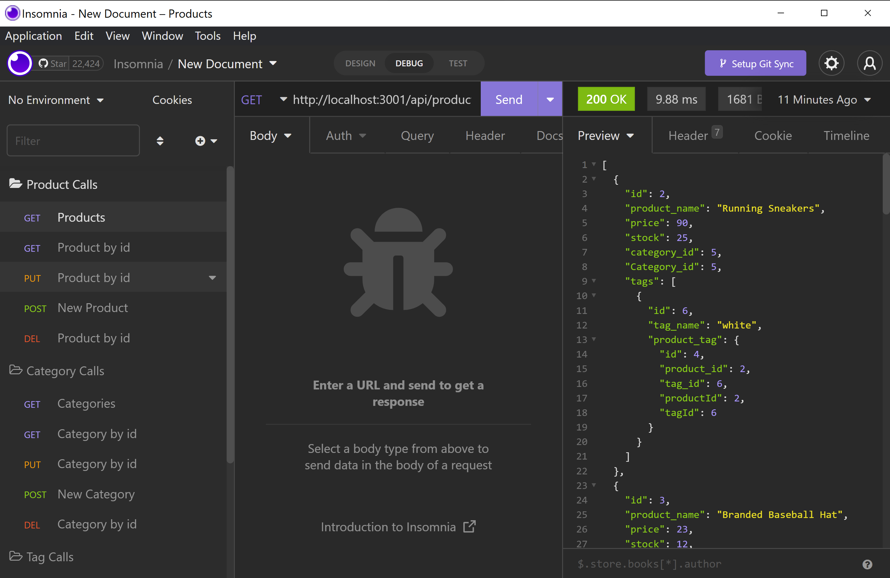

# M13-shamazon
Amazon sucks. Buy local.

### Purpose
- This project is designed to assist with setting up back-end routes and creating sucessful calls to GET, POST, PUT, and DELETE data from an API you created yourself.

## Use
- Download repo
- Once opened within an IDE, create a ".env" file and supply the necessary information (DB NAME, USER, PASSWORD)
- Create the database from your mysql terminal with the "Source db/schema.sql" command
- To seed the database, run the "NPM RUN SEED" command
- To start the application, within your Node Terminal, run the "NPM RUN START" command
- You can now access the routes through insomnia at "http://localhost:3001"

## Routes
- GET /products
    - /products/:id
    - POST
    - PUT
    - DELETE
- GET /categories
    - get /categories/:id
    - POST
    - PUT
    - DELETE
- GET /tags
    - get /tags/:id
    - POST
    - PUT
    - DELETE
